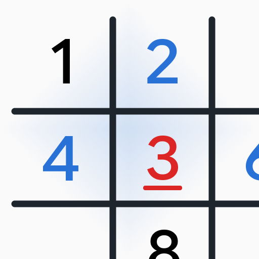

# Rudi UI

<p align="center">
  
</p>

<p align="center">
  An opinionated, accessible Flutter UI system built without Material or
  Cupertino design libraries.
</p>

<p align="center">
  <a href="https://ztomz.github.io/rudi_ui/"><strong>Open the interactive showcase</strong></a>
  ·
  <a href="https://github.com/zTomz/rudi_ui/issues">Report an issue</a>
</p>

Rudi UI provides a coherent app foundation rather than a collection of
unrelated controls. Its themes, surfaces, navigation, feedback and interaction
patterns are designed to work together while remaining fully customizable.

## Why Rudi UI?

- **Independent:** built on Flutter's core widget libraries, with no Material
  or Cupertino production dependency.
- **Accessible:** semantic labels, keyboard interaction, large touch targets,
  high-contrast themes and reduced-motion behavior are part of the components.
- **Adaptive:** phone, tablet and desktop layouts share the same public API.
- **App-ready:** dialogs, bottom sheets, navigation, forms, settings, progress,
  feedback views and direct-manipulation controls use one visual language.
- **Lightweight:** Flutter is the only production dependency. Fonts and icon
  packages remain an application choice.

## Installation

```shell
flutter pub add rudi_ui
```

Or add the package manually:

```yaml
dependencies:
  rudi_ui: ^0.3.0
```

Rudi UI 0.3 requires Dart 3.13 and Flutter 3.47 or newer.

## Quick start

```dart
import 'package:flutter/widgets.dart';
import 'package:rudi_ui/rudi_ui.dart';

void main() => runApp(
  RudiApp(
    title: 'My app',
    home: RudiPage(
      child: Center(
        child: RudiButton(
          label: 'Continue',
          onPressed: () {},
        ),
      ),
    ),
  ),
);
```

`RudiApp` installs the active Rudi theme, transparent system bars, localization
scopes, app-wide messenger and stretch overscroll behavior. `RudiApp.router`
provides the same foundation for Router-based applications. Apps with another
application shell can use `RudiSystemUi` directly.

## Edge-to-edge pages

`RudiPage` respects the top and bottom safe areas by default. Pages that own
their status-bar header or let content scroll behind floating navigation can
opt out of those insets independently:

```dart
RudiPage(
  padding: EdgeInsets.zero,
  safeAreaTop: false,
  safeAreaBottom: false,
  navigation: RudiFloatingNavigationBar(
    destinations: destinations,
    selectedIndex: selectedIndex,
    onDestinationSelected: onDestinationSelected,
  ),
  child: const MyPageContent(),
);
```

`RudiFloatingNavigationBar` handles its own safe area and outer spacing. A
custom widget passed to `navigation` should do the same.

## Components

| Area | Public API |
| --- | --- |
| App foundation | `RudiApp`, `RudiPage`, `RudiSystemUi`, `RudiTheme`, `RudiThemeData` |
| Actions | `RudiButton`, `RudiIconButton`, `RudiPressable` |
| Confirmation | `RudiHoldToConfirm`, `RudiSwipeAction` |
| Navigation | `RudiFloatingNavigationBar`, `RudiNavigationDestination`, `RudiNavigationAction` |
| Forms | `RudiTextField`, `RudiTextFormField`, `RudiNumberInput`, `RudiDurationRuler` |
| Settings | `RudiSettingsSection`, `RudiSettingsGroup`, `RudiSettingsTile`, `RudiSwitchTile`, `RudiOptionTile`, `RudiExpandableControl` |
| Progress | `RudiLinearProgress`, `RudiProgressRing`, `RudiTickProgress` |
| Feedback | `RudiMessenger`, `RudiSnack`, `RudiInfoTooltip`, `RudiEmptyView`, `RudiErrorView`, `RudiLoadingView` |
| Modals | `showRudiDialog`, `RudiDialog`, `showRudiBottomSheet`, `RudiBottomSheet` |
| Date selection | `RudiCalendar` |

The [live showcase](https://ztomz.github.io/rudi_ui/) includes interactive
states, responsive device presets, light and dark themes, direct manipulation
and the latest component APIs.

## Contextual help

Use `RudiInfoTooltip` for short explanations attached to an information action.
It can also be placed directly in a switch row without making the switch and
tooltip compete for the same tap:

```dart
RudiSwitchTile(
  title: 'Comfortable motion',
  value: comfortableMotion,
  onChanged: setComfortableMotion,
  supporting: const RudiInfoTooltip(
    semanticLabel: 'Explain comfortable motion',
    message: 'Uses softer transitions and respects reduced-motion settings.',
  ),
);
```

## Theming

Start with an official light or dark theme, then replace only the roles your
product owns:

```dart
final theme = RudiThemeData.light(
  accent: const Color(0xFF2868D8),
).copyWith(
  text: myTextTheme,
  feedback: const RudiFeedbackPolicy(
    hapticsEnabled: true,
    soundsEnabled: false,
  ),
);

RudiApp(
  theme: theme,
  darkTheme: RudiThemeData.dark(accent: const Color(0xFF6EA0FF)),
  home: const MyHomePage(),
);
```

Rudi deliberately ships no font files and names no font family. Applications
retain ownership of typography assets and their licensing. Custom light, dark
and high-contrast themes are supported.

## Responsive actions

`RudiButton` fills the available width on compact layouts and stays centered at
a maximum width of 560 logical pixels on larger layouts. Use `expand: false`
for inline actions, `minHeight` for taller controls, or `maxWidth: null` to fill
every bounded width.

## Built with Rudi UI

Rudi UI is developed against real applications, so its components are tested
in complete navigation, settings and interaction flows—not only isolated
examples.

<table>
  <tr>
    <td align="center" width="160">
      <a href="https://play.google.com/store/apps/details?id=com.tomvogel.loop">
        
      </a>
    </td>
    <td>
      <strong>Loop</strong><br />
      A focused routine timer available on Google Play.<br />
      <a href="https://play.google.com/store/apps/details?id=com.tomvogel.loop">View on Google Play</a>
    </td>
  </tr>
  <tr>
    <td align="center" width="160">
      <a href="https://github.com/zTomz/Sudoku">
        
      </a>
    </td>
    <td>
      <strong>Sudoku</strong><br />
      A quiet, offline Sudoku app currently in development.<br />
      <a href="https://github.com/zTomz/Sudoku">View the source on GitHub</a>
    </td>
  </tr>
</table>

Built something with Rudi UI? Open an issue or pull request to add it here.

## Development

The repository root is the publishable package. `example/` is the minimal,
dependency-free sample; `preview/` powers the interactive web catalog.

```shell
flutter pub get
dart format --output=none --set-exit-if-changed lib test example tool
dart analyze --fatal-infos
flutter test
dart run tool/check_import_boundaries.dart
dart pub publish --dry-run
```

Rudi UI follows Semantic Versioning. Before 1.0, breaking API changes increment
the minor version. See [CHANGELOG.md](CHANGELOG.md) for release notes and
migration guidance.

## License

Rudi UI is available under the [MIT License](LICENSE).
